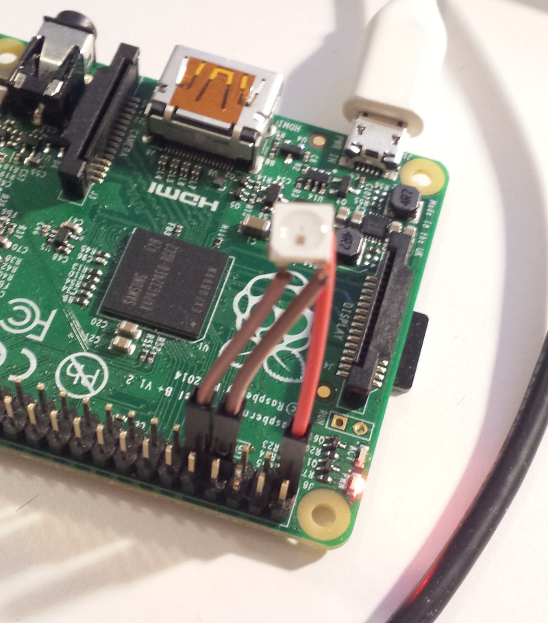

# Overview

This daemon works on RPi side and controls intelligent RGB LED (aka neo pixel) attached to GPIO 0.

# Hardware

I've used WS2812B LED IC which can be powered by 3.3V and controlled from GPIO using one wire.

* LED pin 1 (VCC) is attached to RPi PIN 1 (+3.3V)
* LED pin 2 (Out) is not attached (it can be used to cascading multiple LEDs)
* LED pin 3 (GND) is attached to RPi PIN 9 (GND)
* LED pin 4 (In) is attached to RPi PIN 7 (BCM11)

# Led control tool

It turned out, that led's protocol requires quite high frequencies, which are mostly at the limits of RPi.
Below are timings and low-level protocol from the datasheet, which means that we need to change GPIO pin level at
~14MHz.

This speed is definetely beyond the limits of python, and, even for C code, require some tricks to be used.
To overcome this limitation, low level contol tool was implemented which just sets current led color and nothing more.

It's source code is in led_tool directory, and need to be compiled on RPi. Resulting binary requires super-user
to operate properly (due to low-level hardware access).

It's usage: led_tool red green blue

For example, to switch led to brightest red color:

        pi@pisca:~/led_tool $ ./led_tool 255 0 0
        calibrate 1000000: delta = 21796000, single=21.7960
        zero_1: 18, zero_0: 38
        one_1:  36, one_0:  18
        gap: 2293

# Protocol

By default, daemon listens on port 8000 and handles url /set_led?r=red&g=green&b=blue, for example,
this will set led to red:

        http://pi-host:8000/set_led?r=255&g=0&b=0

# Starting daemon

At initial startup, daemon does LED test, by switching it sequentially to red, green and blue
colors with 1 second interval. To disable this, pass option --no-initial-test.

It expects to find led_tool binary at current directory, which can be redefined by --led_tool option with tool path.